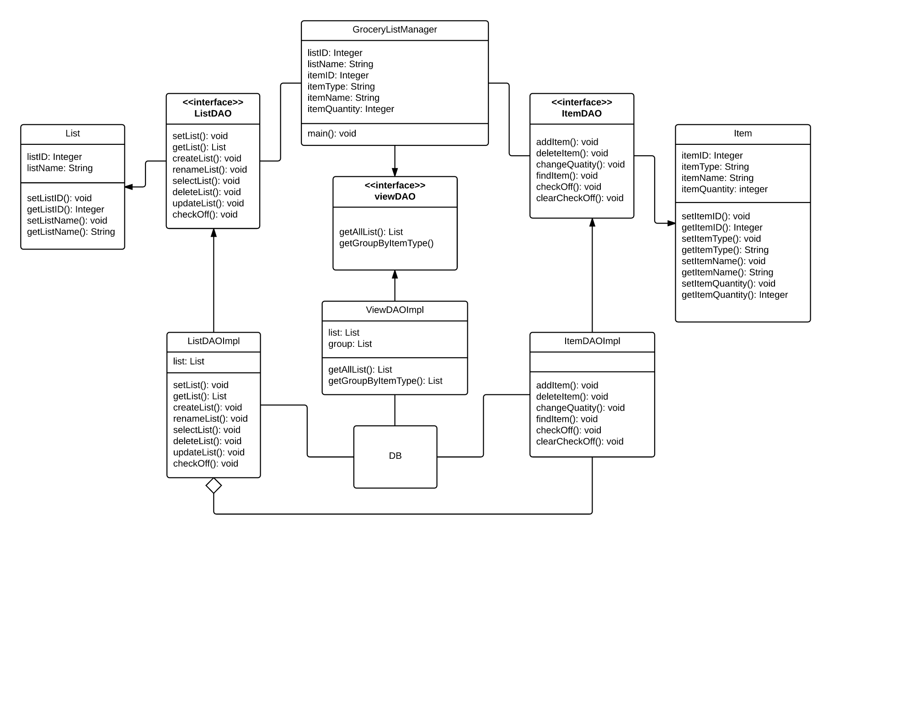
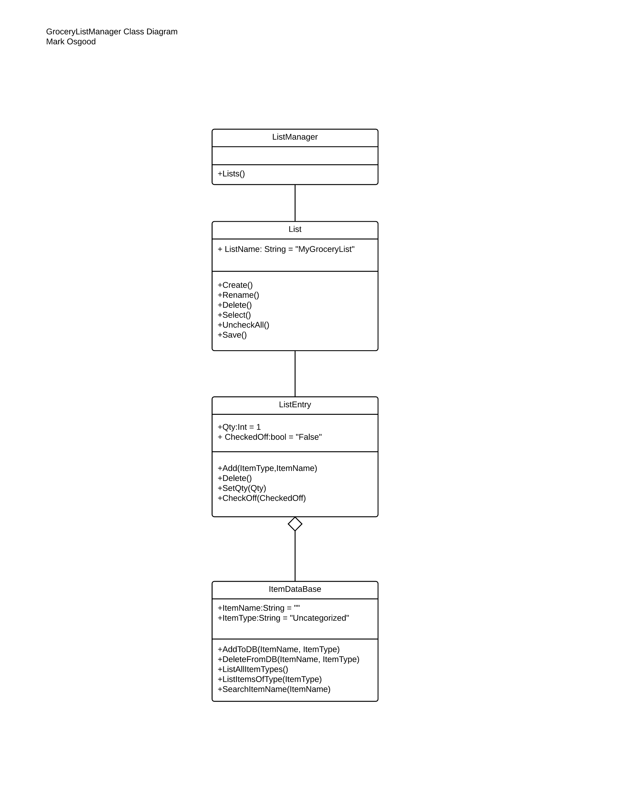
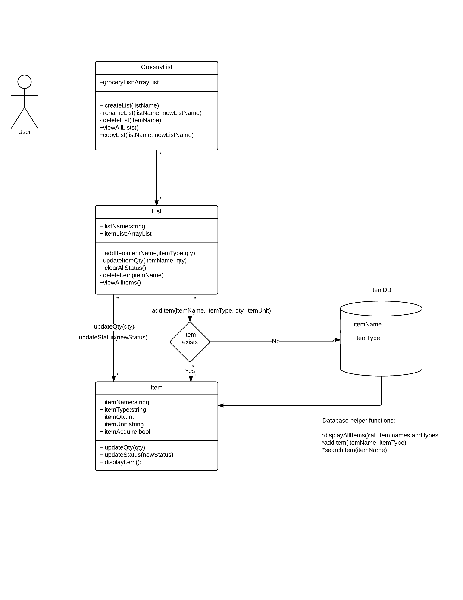
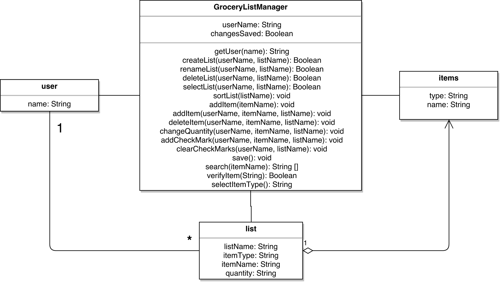
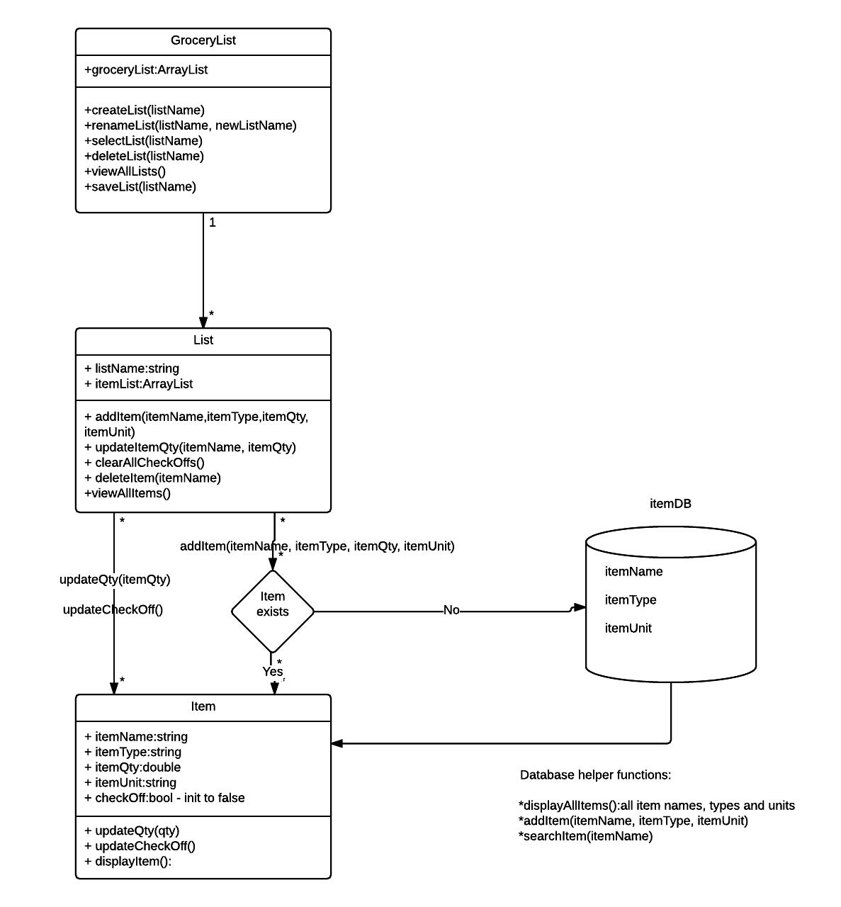

#### Author(s): Kihoon Ahn, Mark Osgood, Huy Pham, Tyler Rodgers	

#### Title: design-discussion.md

#### Purpose: Summarization and comparison document of every team members original design as well as a team created finalized design.

**Design 1:**

*Pros:*
Implementation ready since UML is broken off by classes, interface and implementation. Seems like a good class structure for GroceryListManager, List, and Item. Consistent with the design example structure from lectures. Well subdivided structure. Each class has their clear roles.

*Cons:*
Some of the class methods could be streamlined; for instance, in Item class, setItemType() and setItemName could be combined into one. Database interface details are modeled in great detail. Professor has stated the DB does not need to be modeled in detail; too much focus on dealing with the database than the main functionalities of the program (this makes it seem like an overly complex design.)

**Design 2:**

*Pros:*
Simple overall design; the design meets the requirements with minimum amounts of classes and methods.

*Cons:*
Perhaps, DeleteFromDB() method is not needed with the initial implementation. This could be a function for system admin only. Perhaps lacking sufficient detail. ItemDataBase class in a mash up of item class and Database class. These could perhaps be separated. Does it make sense manage list items as objects rather than just entries in a table? Need to supplement how to communicate with database additionally.

**Design 3:**

*Pros:*
Simple DB model with helper functions. Well described how the program works and the data flow.

*Cons:*
Looks like item lists are considered an attribute of Lists. Is this the best structure? A little unclear relationship between classes. User management is not required. Don't think there should be a many to many relationship between GroceryList and List. Unit should ba added to the database. Qty and Unit should be renamde to itemQty and itemUnit for consistency. All the methods for "status" and itemAcquire should be renamed to checkoff or some variation.

**Design 4:**

*Pros:*
I like the fact the the userName is included with the lists. This could be useful when the lists are stored on a server and it would be easier to work with the data across platforms (mobile, web app, etc). Simple structure. Clearly specified all the functions that are necessarily required in the program.

*Cons:*
I think some of the methods could be broken off into the classes that they belong. In addition, a database would be needed to store all the items available. User management is not required. All operations reside on one super class. This seems counter to the Noun>Class, Atrribute, Verb > Operation analysis method suggested in the lectures. No mention of DB at all. Need to split the functions for the specific purpose.

**Team Design:**

We have decided to use an only slightly modified design 3 for our final submission. We felt that both design 2 and Design 3 were reasonably simple implementations of the design requirements. It was felt that the design 3's use of the the ArrayList type for list content was a more efficient than design 2's approach of managing each list entry as a separate object. One change from the Assignment5 design to our group submission is that the user figure has been eliminated because user management was not part of the specification. One thing that could be addressed with all the designs is how to store the grocery lists. Would a database be needed or system storage or others, etc? This is still an on going discussion of whether to simply use the file storage system or use SQLLite coupled with JSON to store the lists in a database. Due note that we had a lengthy discussion of whether to include the item unit specification in the design as well as the copyList method and deemed that these should be additional requirements for the application. We ruled out design 1 because it seems like an enterprise level design that was deemed overly complex for our application. Design 4 has similar elements; however, we ruled it out because there is too many functions contained within 1 class. In addition, moving the operations into the items and list class this design becomes similar to design 2 and 3. 

**Summary:**
It was very interesting to see how much variation there was in the designs solutions for each team member. The differences originated from how the designer approached the solution. We have a design focused on how data interact, another focused on the process of the list is being used and one focused on the functionalities of the application. Although, once we reviewed and updated a few components from the original designs, all of them started to show a lot of similarities. As a result, we picked a common design then updated it to reflect the positive attributes from all of the original designs.

We found that it is difficult to maintain the focus on only the "What" aspect of the design and not simultaneously consider the "How". This is fully expected and probably a natural part of the process. As we continue with the implementation, we expect that the design will continue to evolve as we find more elegant and better solutions to our original approach. 

Overall, it was very helpful for our group to meet over video chat on a regular basis. We were able to discuss different issues as well as come up with solutions that everyone could agree. We have set up different communication channels to facilitate future discussions and project development.
