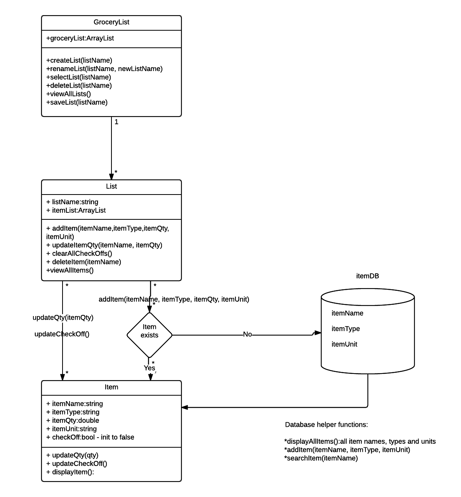

# Design Document

**Author**: 
Team 64
Kihoon Ahn
Mark Osgood
Huy Pham
Tyler Rodgers

## 1 Design Considerations

*The subsections below describe the issues that need to be addressed or resolved prior to or while completing the design, as well as issues that may influence the design process.*

### 1.1 Assumptions

Background:
This document describes the implementation details of the Grocery List software application. The application will be used to create and keep track of grocery lists. It will allow the user to add, update, delete and check off items from different grocery lists.

With the initial release, the software will run on Android operating system (API 19 and above). Support for other operating systems and other platforms will be considered with future development.

### 1.2 Constraints

The following functionalities are the requirements for the software:

1. The application will run on Android operating system API level 19 and above (aka KitKat).

2. The application will support one user per device with initial roll out.

3. A user can create multiple lists as well as multiple items on a list.

4. A user can add an item, remove an item, update quantity on an item, check the item off of the list or un-check all the items on the list.

5. The list can be saved by the user or it will be saved automatically in the device.

Any functionalities that are not covered in the above requirements will be out-of-scope for the initial roll out and will not be considered for development.
### 1.3 System Environment

Hardware:

The application will support mobile devices that run on Android operating system.

Software:

Android API level 19 and above.

## 2 Architectural Design

*The architecture provides the high-level design view of a system and provides a basis for more detailed design work. These subsections describe the top-level components of the system and their relationships.*

### 2.1 Component Diagram

The application consists of four main components: GroceryListManager, List and Item classes and the Item database. These components will facilitate the interactions and allow various operations of the application.

### 2.2 Deployment Diagram

Diagram of all the components and how they would be deployed on an Android device.

## 3 Low-Level Design

### 3.1 Class Diagram

Class structre for all the components and their relationships.

## 4 User Interface Design
Mockups of the GUI prototype:

