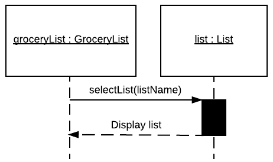

# Use Case Model

**Author**: Team64

## 1 Use Case Diagram

## 2 Use Case Descriptions

*View All Lists*
- Requirements: This must allow the user to view a list of all the lists that currently exist.
- Pre-conditions: None. If no lists exist the application will siply display an empty list of lists.
- Post-conditions: Must display a list of all currently existing lists. Note: This can be blank if it no lists currently exist.
- Scenarios: The user should select the 'View All Lists' button. This will cause the Gorcery List Manager class to call and return all List objects. The return for the Grocery List Manager will be a list of all currently existing List object names.

*Select List*
- Requirements: This use case must allow the user to select an already created list.
- Pre-conditions: The list must exist.
- Post-conditions: The list must still exist and be displayed.

*Create List*
- Requirements: This must allow the user to create a list with the naming of their chossing. Note: There is error handling if a list with the name chosen already exists.
- Pre-conditions: None. There will be error handling should a list exist with the desired name.
- Post-conditions: If a list already exists with the name then the use case will return an error. If a list does not exists already with the name then the use case will create a list object with the specified name along with, by default, selecting the chosen list and displaying it.

*Delete List*
- Requirements: This must allow the user to delete an already existing list.
- Pre-conditions: The list must exist.
- Post-conditions: The list that was designated to be deleted shall no longer exist.

*Rename List*
- Requirements: This must allow the user to rename an already existing list.
- Pre-conditions: The list must exist.
- Post-conditions: The list that was designated to be renamed should contain the new name and not the old name.

*Delete List Item*
- Requirements: This must allow the user to delete an itm that exists on an current list from that list.
- Pre-conditions: Item must exist on the list.
- Post-conditions: Item should no longer appear on the list.

*Check Off Item*
- Requirements: This must allow a user to check mark and un-check mark an item on a list.
- Pre-conditions: The item must exist and be on an existing list.
- Post-conditions: The item should be check marked if it was previously not marked or the item should be unchecked if it was previously marked.

*Update Item Quantity*
- Requirements: This should allow the user to change the quantity of the item on a currently existing list.
- Pre-conditions: THe item must exist on an existing list.
- Post-conditions: The previous quantity should be updatede to the newly specified quantity.

*Clear All Check Marks*
- Requirements: This should allow the user to remove all check marks on a specified list.
- Pre-conditions: None. Nothing will happen if no items are checked prior to execution.
- Post-conditions: All items on the list should be unmarked.

*Add List Item*
- Requirements: This allows the user to add an item to a list either by selecting from an already existing hierarchal list of items or by searching the database for existing items. In the event that an item does not exist in the database, the user can add it to both the database for future use as well as the list.
- Pre-conditions: The item must not exist on the list already.
- Post-conditions: The item should appear on the list. If the item did not exist in the database when the user searched for it, then the item should now appear in the database. 

