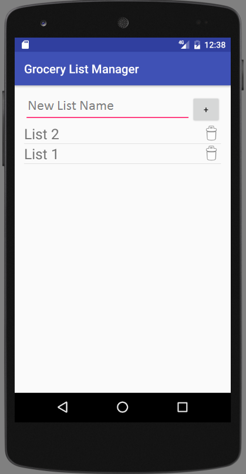
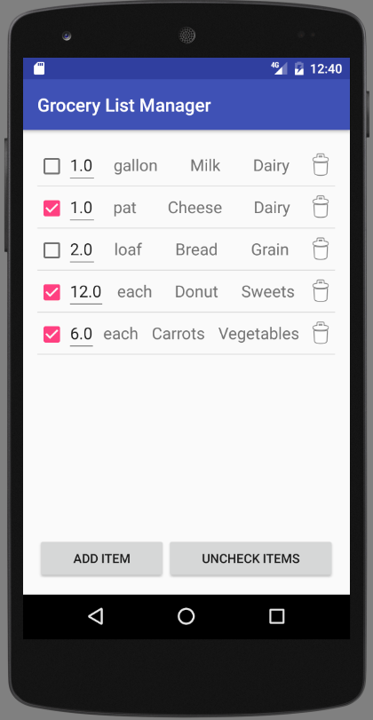
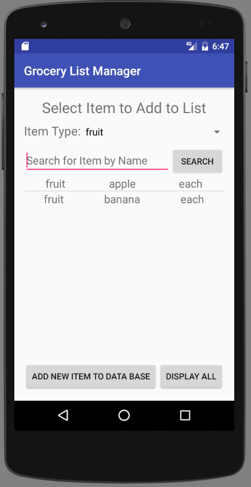
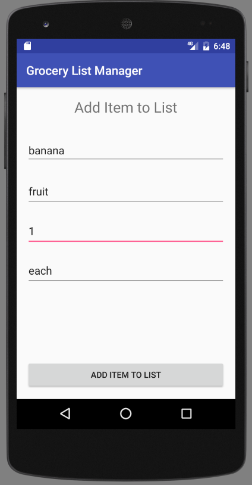

#Grocery List Manager
#User Manual, v00.02
Author: Team64

##Introduction:
Welcome and thank you for being a user of the Grocery List Manager App. This document describes how to use all of the features in the application.

##Requirements:
This application requires Android version 4.4 (KitKat) or above.

##Overview:
The Grocer List Manager is an application for creating and managing shopping lists. Items are displayed in the lists sorted by type to help improve your shopping efficiency. Any changes to lists or items in the list are immediately saved and will be recalled should you exit the App at any time.

##Detailed Operation:
###The List Manager Screen
When you start the app the first screen you see is the List Manager Screen. This is where you create new lists, delete existing lists and select lists for viewing and editing.

 - To create a new list enter the name for your new list in the entry box that shows the prompt "New List Name" and tap the "+" button.
 - To delete an existing list tap the trash can icon to the right of the list name.
 - To select a list for viewing tap on its name
 - To edit a lists name enter the new name for the list into the itpress and hold the list name to be edited.

###The List Screen
When you have selected a list you be brought the List Screen. This screen displays the items in your list. In this screen you can also add, delete, change the quantity and check off items in your list. Items are presented in the list sorted by their type. For each item in the list the  qty, unit, name and check off status of the item is shown. 

 - To add an item to the list tap on the "Add Item" button at the bottom of the screen. This will bring to Item List screen. See Item List screen description below for further details.
 - To check off an item on the list tap on the check box for that item. Please note that the item is not removed from the list when you check it off.
 - To un-check all items on the list tap on the "Uncheck Items" button. This allows you to re-use lists without entering all of the items again.
 - To delete an item from the list tap on the trash can icon for that that item.
 - To Change the qty of an item in the list tap the quantity value for the item you wish to change.
 - Swipe to scroll the list

###The Item List Screen
When you tap on the "Add Item" button in the List Screen you will be brought to the Item List screen. In this screen you can select an item to add to the list, search for items by type or by name and add new items to the database of items. When you first arrive at this screen a list of all items currently in the application's database will be displayed.

 - To directly add an item to your list already in the database simply scroll thought the item list and tap on the item to add. Upon doing this the Add Item screen will be shown, see the Add Item screen description for further details.
 -  If the item you wish to add to your list is not currently in the database you can add an item by tapping on the  "Add New Item to Database" button.
 - To find an item by type tap on the "Item Type" spinner at the top of the screen and select from the available list of item types. Once you select a type the list of items displayed will be filtered such that only items of this type are shown. Tap on the item to add it to your list. To reset the list of items to show all items in the database again click on the "Display All" button.
 - To find an item by searching for its name enter text into the "Search for Item by Name" entry box. The list below will show items that contain this text in their name. Tap on the desired item to add it to your list. To reset the list of items to show all items in the database again click on the "Display All" button.

###The Add Item Screen
When you tap on an item in the Item List screen or tap on the "Add new item to database" list entry the Add Item screen will be shown. This allows you to specify some final details about your item and add it to the list. 

 - If in the Item List screen you tapped on an item already existing in the database then in the Add Item Screen the item name, type and unit will be shown. Edit the "Quantity" entry box to your desired value. Then click "Add Item to List" button to add this item to your list.
 
 - If in the Item List screen you clicked on the "Add new item to database" button then populate the entry boxes for Item Name, Item Type, Quantity, and item Unit and click on the "Add item to List" button. The new item will both be added to your list and to the database.